# Skill 写得好不等于用得好：一套从测评到自动优化的闭环实现

> Skill 数量井喷，但没人知道哪些 Skill 真的好使。我们造了一套从评估到改进到验证的全闭环流水线。
> 15 个 skill、8000 行 Python、409 个测试，已发布到 ClawHub。

## 你的 Skill 真的好使吗？

OpenClaw 火了之后，Skill 数量井喷。ClawHub 上 5400+ 个 skill，团队内部几十个，但有一个问题所有人都在回避：**你怎么知道你写的 skill 是好使的，而不只是"看起来能跑"？**

目前的验证方式：自己手动试几次、让同事跑几个 case、看看能不能触发。这套方式在 skill 少的时候能凑合，多起来就完全不够了——没有统一标准，没有稳定性概念，更没有自动化的改进闭环。

我搭了一套系统来解决这件事。过程中发现了一个推翻所有假设的事实：

**结构评分和实际执行效果的相关系数是 R² = 0.00。**

不是接近零，是字面意义上的零。你的 SKILL.md 写得再漂亮——frontmatter 完整、When to Use 齐全、示例代码丰富——跟 AI 能不能在真实场景下正确执行，**没有任何统计关系**。一个评分 0.88 的 skill 反而比评分 0.70 的执行更差。

这意味着：**目前市面上所有基于文档结构打分的 skill 评估方案，包括 ClawHub 的 skill-quality-check、PromptFoo 的 assertion 检查，从根本上就测错了东西。** 它们测的是"文档卫生"，不是"指导质量"。

这个发现改变了我做这件事的方向。不能只检查文档写得好不好，得让 AI 真正拿着 SKILL.md 去跑任务，看它到底能不能做对。然后把做不对的信息反馈回来，自动改进 SKILL.md，再跑，再验证——直到它真的好使为止。

下面讲这套系统是怎么搭的，以及它现在能做到什么。

## 偷师：从蒸馏别人的仓库开始

Claude Code 的 Skill 就是一个 SKILL.md 文件加几个脚本，告诉 AI 遇到特定任务该怎么干。GitHub 上有人整理了不错的合集：alirezarezvani/claude-skills 有 10 个质量模式，affaan-m/everything-claude-code 搞了 116 个 skill 的架构。我不想从零写，想拿来改改用。

手动抄一两个没问题。但 skill 一多——我陆续看中了三四十个——一个个搬就烦了。我写了个 skill-distill 工具，喂进去 N 个功能有重叠的 skill，它把知识分成交集、独有、冲突、冗余四类，让你确认合并方案，然后吐出一个蒸馏版。

### 蒸馏案例：deslop（反 AI 味写作）

GitHub 上有两个相关 skill——slopbuster（280 行，英文为主，覆盖学术/代码/散文三种模式）和 humanizer（559 行，偏通用文本去 AI 痕迹）。两个 skill 有大量重叠：都列了 AI 高频词表，都有评分量表，都做模式替换。但 slopbuster 有代码注释专用模式，humanizer 有更细的语气校准。

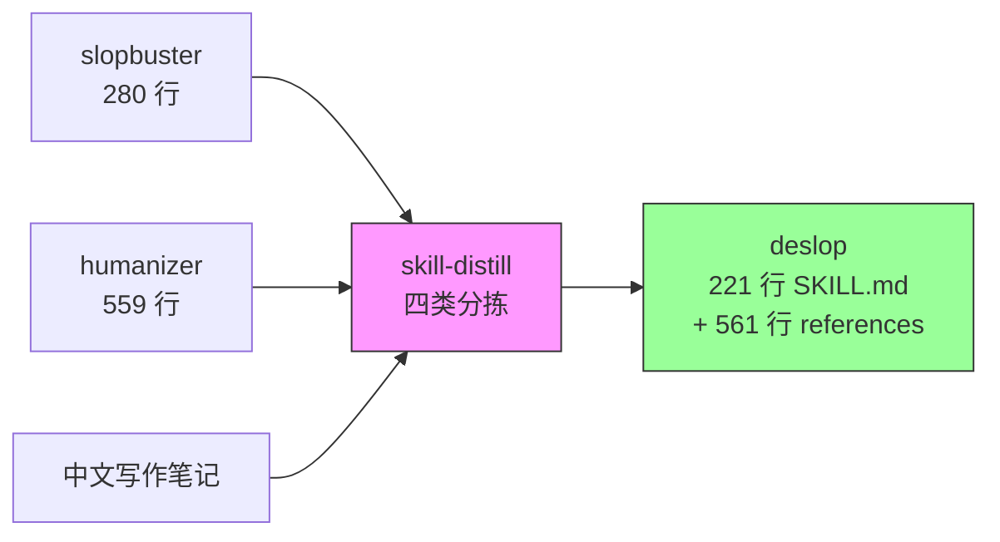

交集部分（AI 词汇表、评分标准）合并去重。slopbuster 独有的代码模式保留为"不适用场景"指向原 skill。humanizer 独有的 voice calibration 保留进 references。冲突的地方——比如两个 skill 对 em dash 的容忍度不同——弹出来让我手动选。

蒸馏完的 deslop 比任何一个源 skill 都好用。这篇文章本身就是用 deslop 从 7.5 分改到 8.4 分的。

### 蒸馏案例：execution-harness（agent 执行可靠性）

这个的来源更杂：claude-reviews-claude 的 17 篇架构文章、oh-my-claudecode (OMC) 的 npm 源码、ccunpacked.dev 的 Claude Code 拆解、luongnv89/claude-howto 的实践 tips。四个来源讲的都是同一件事——怎么让 dispatched agent 不要半路停下来——但每个的侧重点不同。

OMC 的核心贡献是 Ralph 模式：利用 Claude Code 的 Stop hook，在 agent 试图结束 session 时拦截它，注入"你还没做完"的续航指令。这个模式有个致命的细节——**它只在 interactive 模式下工作**，headless `-p` 模式的 Stop hook 根本不触发。我在 OMC 源码里花了两个小时才确认这一点，因为文档没写。

蒸馏后是 21 个可组合的 pattern，质量分从 0.63 升到 0.93。但这个蒸馏过程比 deslop 难多了——deslop 的三个源都是同类文档，而 execution-harness 的四个源分别是博客文章、npm 包源码、技术拆解网站和 tips 集合，格式和抽象层次完全不同。

## 整体架构

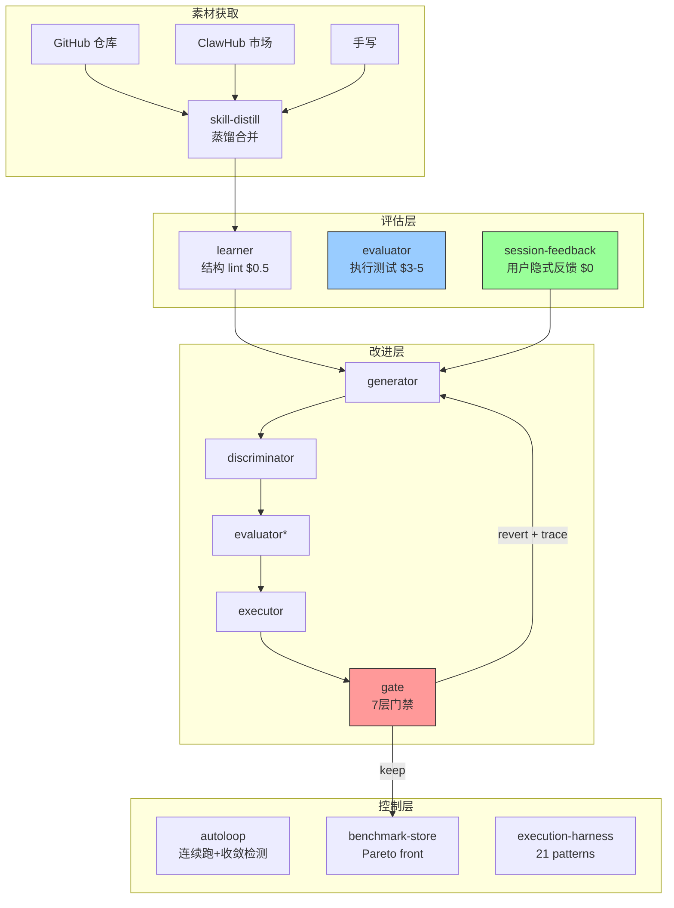

15 个 skill 分三层：

- **评估层**：learner 做结构检查（$0.5/次），evaluator 跑真实任务测执行效果（$3-5/次），session-feedback-analyzer 从用户实际使用中挖隐式反馈（免费）
- **改进层**：generator → discriminator → evaluator → executor → gate，带 trace-aware 重试
- **控制层**：gate（七层门禁）、autoloop-controller（连续跑 + 收敛检测）、benchmark-store（Pareto front + 质量分级）

## R² = 0.00 的故事

先写了个评分器 improvement-learner，六个维度打分，每个维度按 skill 类别差异化权重：

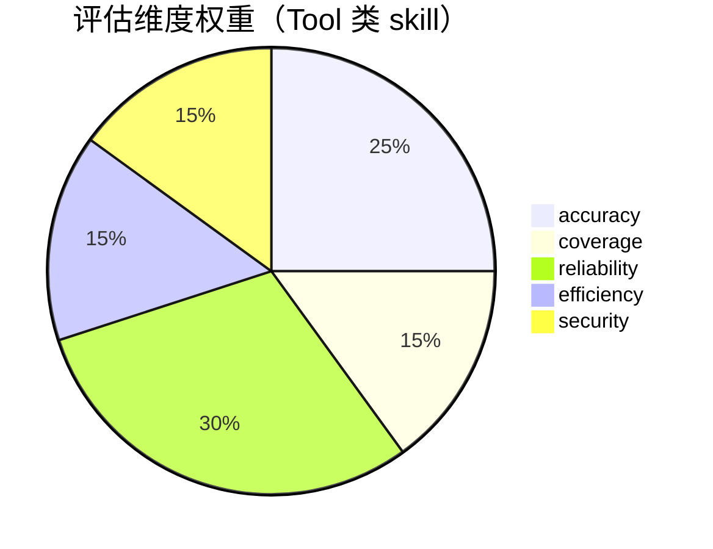

| 类别 | accuracy | coverage | reliability | efficiency | security |
|------|----------|----------|-------------|------------|----------|
| Tool（工具型） | 25% | 15% | 30% | 15% | 15% |
| Knowledge（知识型） | 40% | 20% | 10% | 20% | 10% |
| Orchestration（编排型） | 30% | 20% | 25% | 10% | 15% |
| Review（评审型） | 35% | 15% | 25% | 10% | 15% |

28 个 skill 跑了一遍，零个达到 POWERFUL（>= 85%）。我当时还挺得意——可以量化了嘛。

然后拿真实任务验证。5 个 skill 的结构评分 vs 实际执行通过率：

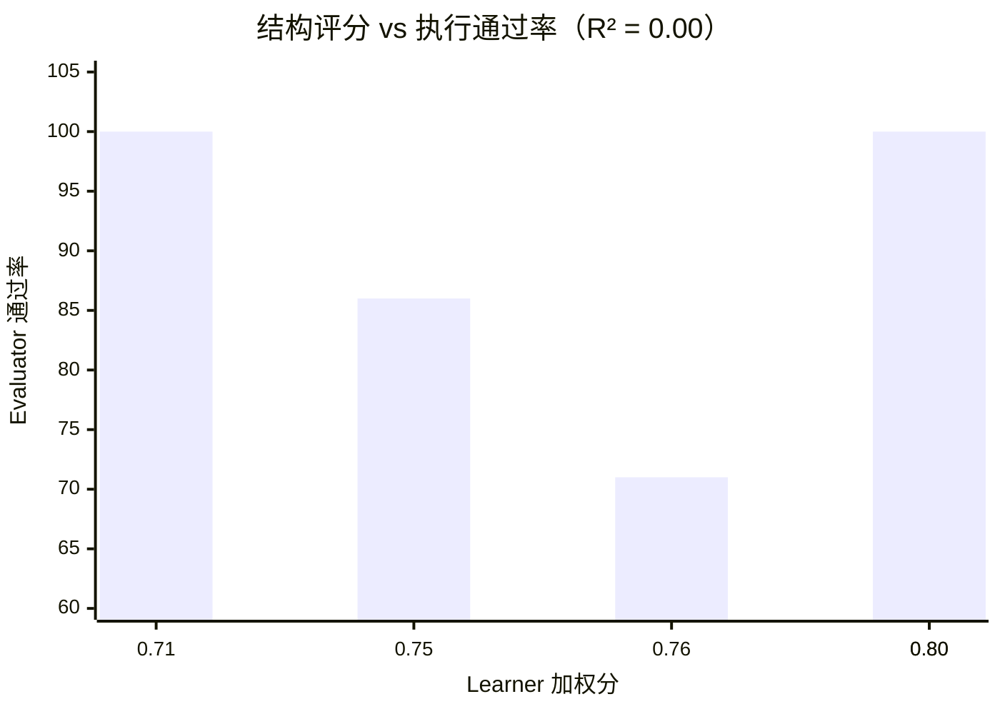

加权分 r = -0.40，方向是反的——learner 分越高，实际执行越差。

为什么？拆开看 26 个检查项：17 个在所有 skill 上都通过（零方差，无区分度），3 个是**反向预测**——通过的 skill 实际表现更差。比如"frontmatter 里有 version 字段"这项，通过它跟执行效果的相关系数是 r=-0.76。

可能的解释：最用心维护 frontmatter 格式的 skill 作者，把精力花在了文档美化而不是指令质量上。

结论不是"结构不重要"，而是"我们的结构检查测错了东西"。

### 从 regex 到 LLM-as-Judge

最早的 accuracy 评估用 regex 做。检查"有没有代码示例"就是 grep 一下有没有 ``` 代码块。这个做法的问题：一个 skill 可以有 10 个代码块但全是语法展示（`python3 script.py --flag`），没有一个展示输入→输出的完整示例。regex 检查通过，但质量其实很差。

换成 LLM-as-Judge 后，accuracy 检查变成了把 SKILL.md 发给 Claude，让它从 5 个维度打分：clarity、specificity、completeness、actionability、differentiation。

成本从 $0（regex）涨到 ~$0.5/eval，但区分度大幅提升。原来 17/26 检查项零方差的问题消失了。

但 R² 还是 0.00。因为问题不在评估方法上——是"文档质量"和"指导质量"本就是两件事。这个认知花了很长时间才接受。

## 两层评估 + 用户反馈闭环

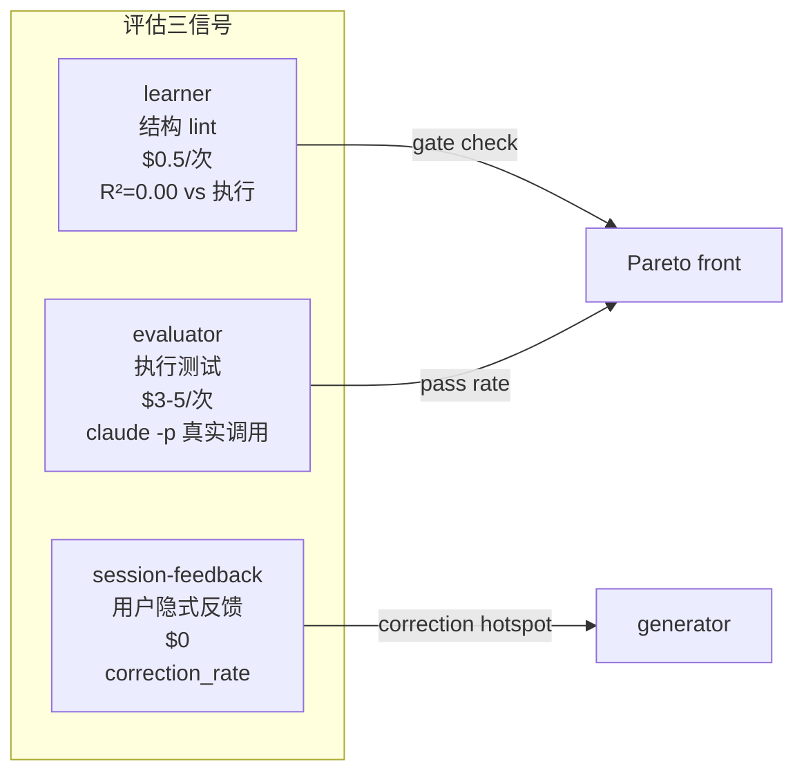

### Task Suite 执行测试

执行层是真金白银。task suite 格式：

```yaml
skill_id: "release-notes-generator"
tasks:
  - id: "leakage-01"
    description: "iOS notes must not contain Android keywords"
    judge:
      type: "llm-rubric"
      rubric: |
        Check output does NOT contain "Kotlin", "Android", "Java".
        Score 1.0 if clean, 0.0 if any leakage.
      pass_threshold: 0.8
```

三种 judge：ContainsJudge（关键词检查）、PytestJudge（pytest 验证）、LLMRubricJudge（语义评分）。

### Skill 到底有没有用？

prompt-hardening skill 的 7 个任务，加载 skill 和裸跑 Claude 的通过率一样——都是 86%。但挂的任务不同：

```mermaid
xychart-beta
    title "加载 Skill vs 裸跑 Claude（通过率都是 86%）"
    x-axis ["P1三重强化", "P5反推理", "审计格式", "CLI路径", "模式选择", "可靠性", "端到端"]
    y-axis "PASS=1 / FAIL=0" 0 --> 1.2
    bar "裸跑" [1, 1, 1, 0, 1, 1, 1]
    bar "加载Skill" [1, 1, 0, 1, 1, 1, 1]
```

Skill 的价值在注入特定知识（audit.sh 路径），不是让 Claude 变聪明。但注入知识有代价——输出格式偏好变了，造成新的失败模式。

### 用户反馈闭环

task suite 测的是作者预设的场景。用户在真实使用中遇到的问题，task suite 未必覆盖。session-feedback-analyzer 从 Claude Code 的会话日志里挖隐式反馈：

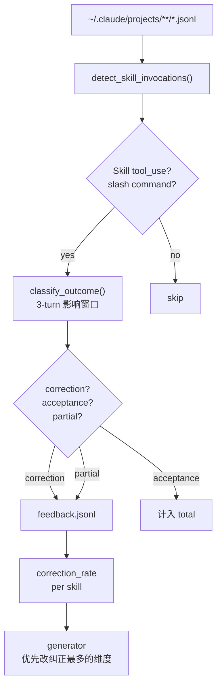

纠正信号检测规则：

| 信号 | 检测方式 | 置信度 |
|------|---------|--------|
| 明确否定 | "不对"/"错了"/"wrong" | 0.9 |
| 撤销操作 | git checkout/restore | 0.9 |
| 部分纠正 | 接受词 + 转折词（"可以但是"） | 0.7 |
| 静默继续 | 用户换话题，未纠正 | 0.6 |

在我的 session 数据上跑了一遍：28 个反馈事件，code-review-enhanced 被纠正最多（9 次）。这跟我的体感一致——它生成的 review 评论经常需要我手动调整措辞和优先级。

## 自动改进流水线

直接重试不行。LLM 容易翻来覆去犯同一个错——我们叫它 "Ralph Wiggum loop"，说着 "I'm helping!" 然后帮倒忙。

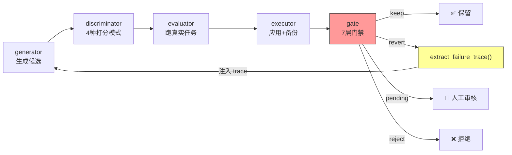

失败追踪的数据结构：

```json
{
  "type": "failure_trace",
  "candidate_id": "docs-accuracy-001",
  "decision": "revert",
  "reason": "accuracy regressed 12%",
  "gate_blockers": ["RegressionGate: accuracy 0.85 -> 0.75"]
}
```

generator 读到"docs-accuracy 策略在 accuracy 维度上失败了 3 次"，就跳过这个策略。思路来自 GEPA 论文（ICLR 2026）的 trace-aware reflection。

### Gate 七层门禁

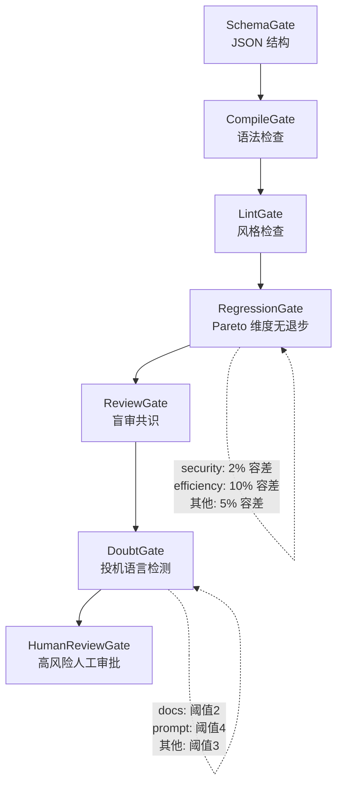

RegressionGate 用的 Pareto front，代码（`lib/pareto.py`）：

```python
def check_regression(self, scores, tolerances=None):
    for dim, best in best_per_dim.items():
        tol = tolerances.get(dim, 0.05)  # per-dimension tolerance
        if new_score < best * (1 - tol):
            regressions.append({"dimension": dim, "best": best, "new": new_score})
    return {"regressed": len(regressions) > 0, "regressions": regressions}
```

为什么不用一个总分？accuracy=0.85/coverage=0.70 改成 accuracy=0.70/coverage=0.85，加权得分完全相同。但准确度被毁了。Pareto front 要求每个维度独立不退步。

## 执行可靠性：agent 为什么老停

这些自动改进任务丢进 tmux session 让 dispatched agent 跑。但 Claude Code agent 有个毛病：它经常觉得自己"做完了"然后停下来，实际上只改了一半。我在批量改进 28 个 skill 的时候，大概有 40% 的 session 是 agent 跑到一半自己停了。

### Ralph：拦住不让停

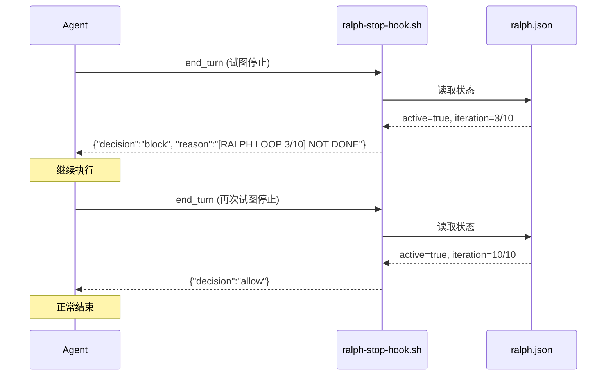

五个安全阀防止 Ralph 把 agent 永远困住：context >= 95%、认证错误 401/403、cancel 信号（30s TTL）、闲置 > 2 小时、达到上限。

### Handoff：context 压缩了怎么办

Claude Code 压缩 context 时，设计决策、被否决的方案、已知风险会被丢掉。Handoff 文档解决这个问题——agent 在阶段结束时写 `handoffs/stage-N.md`，包含 Decided/Rejected/Risks/Remaining。文件在磁盘上，不受 context 压缩影响。

## 实验数据

### 批量改进 4 个 GENERIC Skill

```mermaid
xychart-beta
    title "改进前后对比（GENERIC → SOLID）"
    x-axis ["system-maintenance", "perf-profiler", "component-dev", "release-notes"]
    y-axis "加权分" 0.6 --> 0.9
    bar "改进前" [0.653, 0.661, 0.665, 0.681]
    bar "改进后" [0.803, 0.803, 0.798, 0.831]
```

平均 +0.138，从 GENERIC 全部升到 SOLID。API 费用 $15-20。

最大的单项跳跃是 reliability：0.30 到 1.00——learner 发现 skill 有脚本但没测试，自动生成了测试桩，测试跑过了。

### 自评：均分 83.3% → 91.2%

用同样的评估管线给自己的 15 个流水线 skill 打分。经过几轮 SKILL.md 充实后：

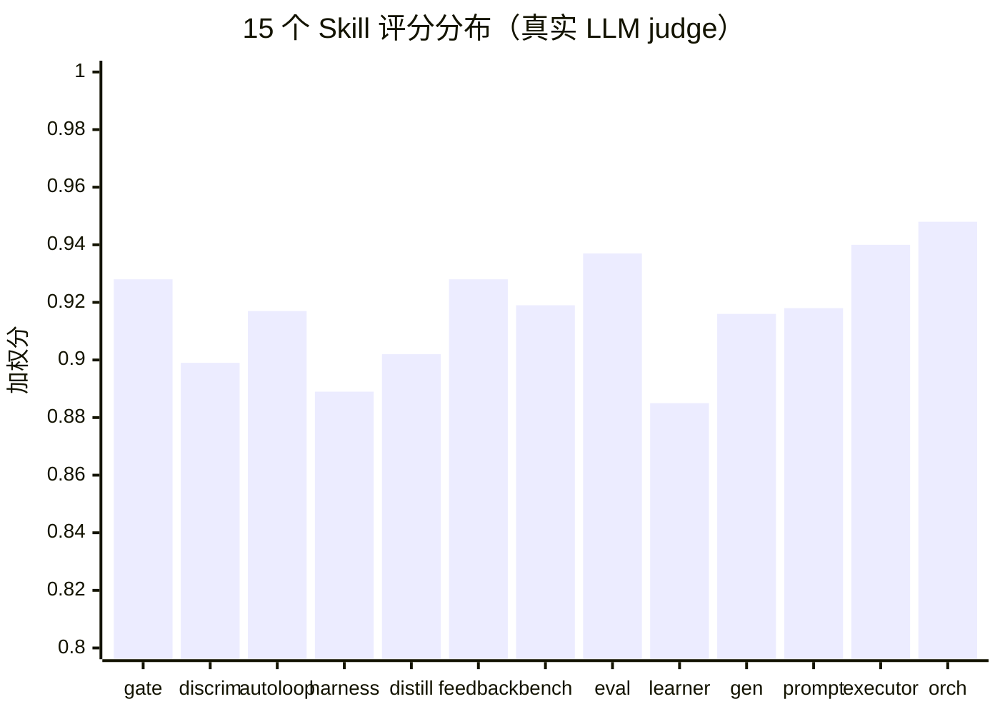

13/15 达到 POWERFUL（>= 85%）。讽刺的发现：做评估框架的项目，自己的文档曾经是最差的——discriminator 有 620 行 score.py，SKILL.md 只有 26 行。

## 我们做了什么别人没做的

这个领域不缺工具。DSPy 做 prompt 优化，PromptFoo 做 assertion 检查，LangSmith 做可观测性，Karpathy 的 autoresearch 做单标量自动优化。但把这些能力**组合成一个针对 Skill 的闭环系统**——从评估到改进到验证到持续运行——目前只有我们在做。

| 系统 | 优化对象 | 粒度 | diff 可读？ | 多维度？ | 反馈来源 |
|------|---------|------|:-----------:|:-------:|---------|
| **本项目** | SKILL.md 文档 | 段落 | ✅ | 6维 Pareto | task suite + 用户隐式反馈 |
| DSPy | prompt token | token | ❌ | 单目标 | 用户定义 metric |
| TextGrad | LLM 输出变量 | token | ❌ | 单目标 | LLM "梯度" |
| GEPA | 代码生成 | 函数 | ✅ | 单目标 | trace reflection |
| PromptFoo | prompt assertion | prompt | ✅ | 单维 | assertion suite |
| LangSmith | agent trace | trace | N/A | 多 metric | 可观测性平台 |
| Karpathy autoresearch | train.py | 文件 | ✅ | 单标量 | 训练 loss |

几个关键差异化：

**执行效果评估，不是文档检查。** PromptFoo 和 ClawHub 的 skill-quality-check 做的是 assertion 检查。我们的 evaluator 让 AI 真正拿着 SKILL.md 去跑任务，看它到底能不能做对。R²=0.00 告诉我们：文档检查和执行效果之间没有统计关系，你必须实际跑。

**多维度 Pareto，不是单一分数。** DSPy、autoresearch、PromptFoo 都用单一标量。单一标量的陷阱：accuracy 涨了但 trigger_quality 崩了——加权得分还涨了。Pareto front 要求每个维度独立不退步，98 行 Python 拦住了至少三个 skill 被搞坏。

**用户隐式反馈闭环。** 所有开源方案里没人做的事。LangSmith 做 trace 采集但止步于 dashboard。我们的 session-feedback-analyzer 从 Claude Code 会话日志提取用户纠正信号，**直接对接 generator 驱动下一轮改进**。用户改了 AI 的输出——这个信号在所有现有方案里都被浪费了。

**diff 可读。** DSPy 的 MIPROv2 在 token 粒度做搜索，改完看 diff 经常是懵的。我们改的是段落和示例，每个 diff 人能读懂、能判断、能回滚。

**连续自主运行。** 不是手动跑一次。设好 cost cap，睡前启动，第二天看报告。Karpathy 用 700 次实验两天提升 11%，我们在 4 个 skill 上平均 +0.138，费用 -20。

## 连续跑

autoloop-controller 包了个外层循环，检测三种停止信号：

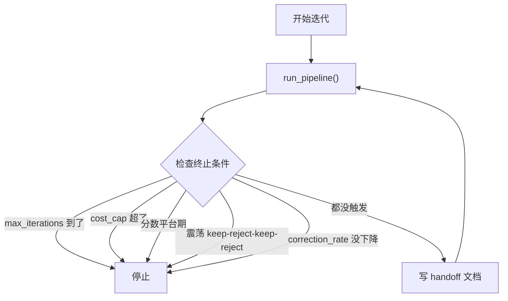

状态持久化到 JSON，进程挂了重启接着跑。每轮写 `handoffs/iteration-N.md` 记录 Decided/Rejected/Scores/Remaining，保证跨迭代上下文存活。

## 实际效果

先说数字：

- **4 个 GENERIC skill → 全部 SOLID**，平均 +0.138，总费用 $15-20
- **15 个管线 skill 均分 83.3% → 91.2%**，13/15 达到 POWERFUL
- **session-feedback-analyzer** 从真实会话提取 28 个反馈事件，code-review-enhanced 被纠正 9 次——跟体感完全一致
- **409 个测试**全部通过，依赖只有 pyyaml 和 pytest，不需要任何外部服务（除了 evaluator 的 `claude -p`）
- 已发布到 **ClawHub**，搜索 `auto-improvement` 即可安装

几个关键教训：

**先有评估再做改进。** 我最初顺序反了——先写 generator 和 executor，改完不知道好不好。掉头先做评估之后一切才顺起来。听起来像废话，做起来真的会忘。

**Pareto front 是 ROI 最高的组件。** 98 行 Python，拦住了至少三个 skill 不被"优化"搞坏。加权得分的陷阱防不胜防——accuracy 涨了但 trigger_quality 崩了，总分居然还涨了 0.02。

**成本控制是设计约束，不是事后补丁。** evaluator 一次 $3-5，100 个 skill 的团队一个月可能 $5000。conditional evaluation（低分候选跳过 evaluator）省了 60%，但这是后来才补的。

## 还没解的（欢迎一起想）

**循环依赖**仍然是最大的问题。task suite 和 SKILL.md 通常一个人写——你测的就是你教的。我们做了两件事缓解（session-feedback-analyzer 提供独立信号，null-skill calibration 过滤裸跑就能过的任务），但根本解法可能需要社区参与：如果写 task suite 的人不是写 SKILL.md 的人，循环就断了。

**Skill 副作用**没有好的量化方法。加载 prompt-hardening 后通过率跟裸跑一样是 86%，但失败的任务不同——修好了 A，B 坏了。这不是 bug，是 skill 注入知识后注意力分配变化的固有属性。

**多模型衰减曲线**还没跑。同一个 task suite 在 Opus/Sonnet/Haiku 上的 pass rate 衰减能反映 skill 对模型"聪明度"的依赖——衰减越平缓说明 skill 自身的指令设计越扎实。evaluator 已经支持 `--model` 参数，但还没有系统性地做过对比实验。

## 试一下

15 个 skill，8000+ 行 Python，409 个测试。**整套系统只依赖 pyyaml 和 pytest**，不需要任何外部服务（evaluator 的 `claude -p` 除外）。

```bash
# 安装
git clone https://github.com/lanyasheng/auto-improvement-orchestrator-skill.git
pip install pyyaml pytest

# 给你的 skill 打个分
python3 skills/improvement-learner/scripts/self_improve.py --skill-path /your/skill --max-iterations 1

# 自动改进（5 轮，Pareto 保护）
python3 skills/improvement-learner/scripts/self_improve.py --skill-path /your/skill --max-iterations 5

# 从你的 Claude Code 会话中提取反馈
python3 skills/session-feedback-analyzer/scripts/analyze.py --output feedback.jsonl
```

- GitHub: [lanyasheng/auto-improvement-orchestrator-skill](https://github.com/lanyasheng/auto-improvement-orchestrator-skill)
- ClawHub: `openclaw skills install auto-improvement-orchestrator`

如果你在做 skill 质量相关的事——不管是评估、测试还是自动改进——欢迎在 GitHub 上开 issue 讨论，或者直接贡献 task suite（**这是打破循环依赖最需要的东西**）。
