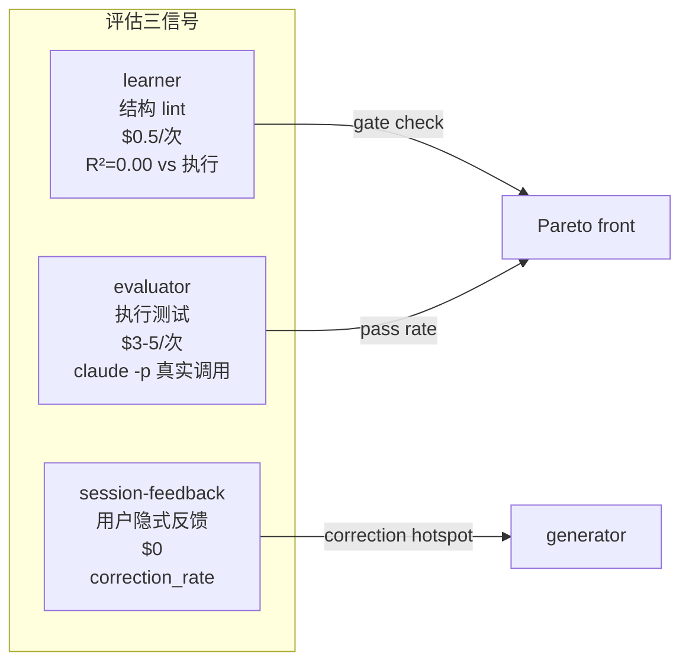
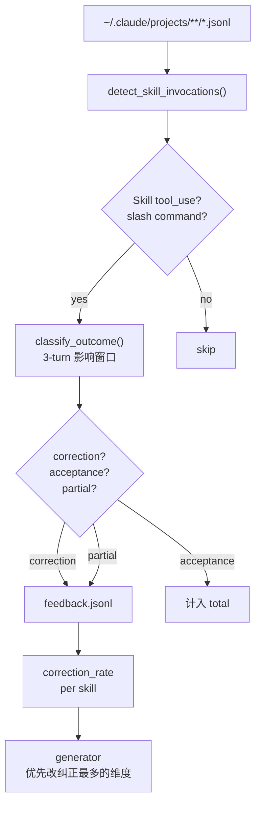
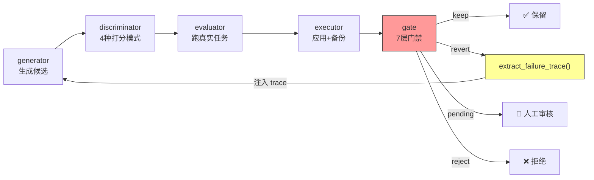
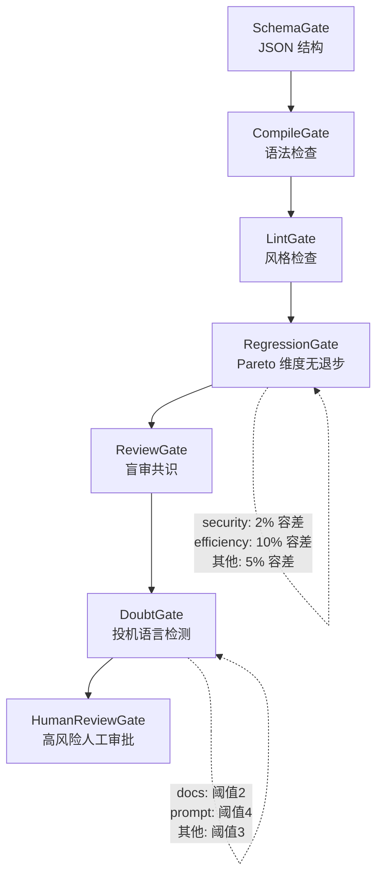
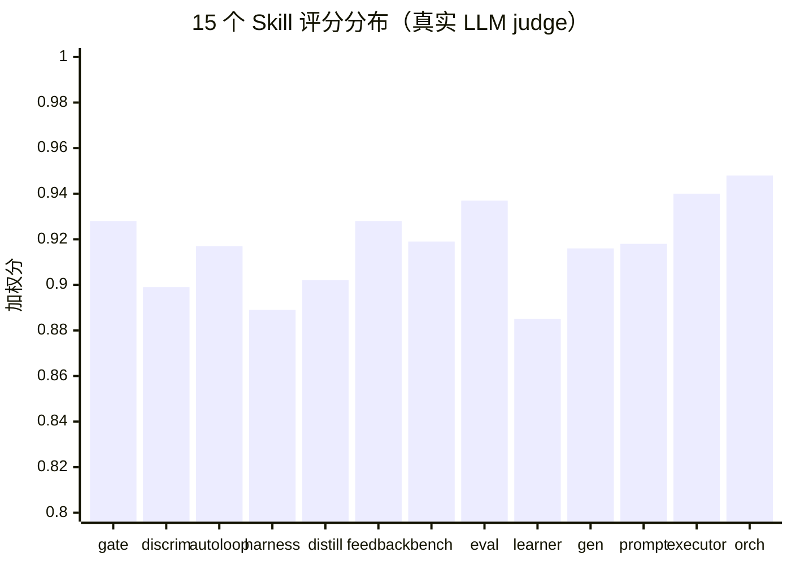
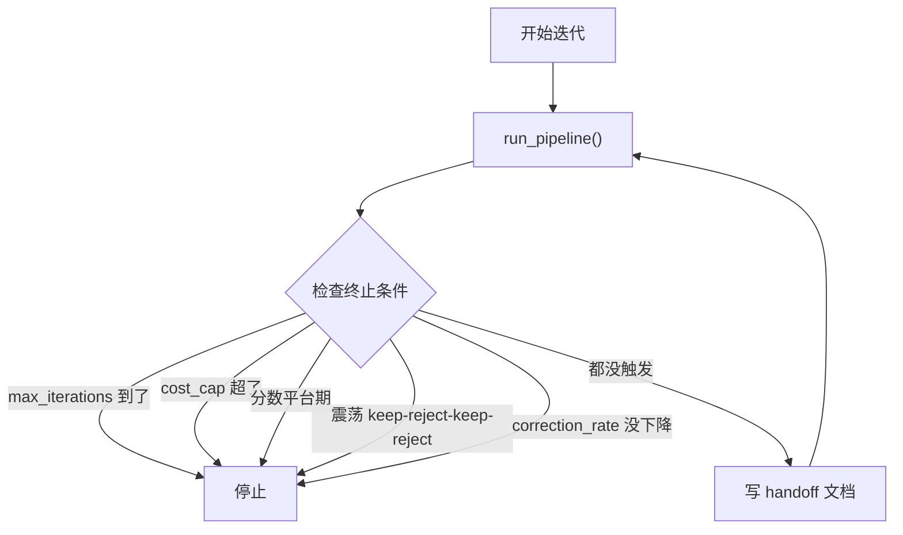

# 让 Skill 自己变好：一套从蒸馏到测评到自动优化的工程实践

> 不是论文，是 15 个 skill、8000 行 Python、432 个测试的完整实现。
> 已发布到 ClawHub，`openclaw skills install auto-improvement-orchestrator` 即可使用。

## 起因：改了 Skill 之后不知道是变好了还是变差了

OpenClaw 生态的 Skill 数量已经上万（VoltAgent 精选集筛选后 5000+），团队内部也有几十个。写 Skill 不难，难的是改完之后判断效果。你加了一段 guardrail，到底是提升了安全性还是干扰了正常输出？你补了一个 example，到底是帮到了 AI 还是占了上下文预算？

目前的做法：手动试几次、让同事跑几个 case、凭感觉觉得"还行"。Skill 少的时候能凑合，规模上来之后就不够了。没有统一标准，没有稳定性度量，更没有自动化的改进机制。

我搭了一套系统来解决这件事。过程中发现了一个推翻所有假设的事实：

**结构评分和实际执行效果的相关系数是 R² = 0.00。**

不是接近零，是字面意义上的零。你的 SKILL.md 写得再漂亮——frontmatter 完整、When to Use 齐全、示例代码丰富——跟 AI 能不能在真实场景下正确执行，**没有任何统计关系**。一个评分 0.88 的 skill 反而比评分 0.70 的执行更差。

这意味着：**目前市面上所有基于文档结构打分的 skill 评估方案，包括 ClawHub 的 skill-quality-check、PromptFoo 的 assertion 检查，从根本上就测错了东西。** 它们测的是"文档卫生"，不是"指导质量"。

这个发现改变了我做这件事的方向。不能只检查文档写得好不好，得让 AI 真正拿着 SKILL.md 去跑任务，看它到底能不能做对。然后把做不对的信息反馈回来，自动改进 SKILL.md，再跑，再验证，直到它真的好使为止。

下面讲这套系统是怎么搭的，以及它现在能做到什么。

## 偷师：从蒸馏别人的仓库开始

Claude Code 的 Skill 就是一个 SKILL.md 文件加几个脚本，告诉 AI 遇到特定任务该怎么干。GitHub 上有人整理了不错的合集：alirezarezvani/claude-skills 有 10 个质量模式，affaan-m/everything-claude-code 搞了 116 个 skill 的架构。我不想从零写，想拿来改改用。

手动抄一两个没问题。但 skill 一多（我陆续看中了三四十个），一个个搬就烦了。我写了个 skill-distill 工具，喂进去 N 个功能有重叠的 skill，它把知识分成交集、独有、冲突、冗余四类，让你确认合并方案，然后吐出一个蒸馏版。

### 蒸馏案例：deslop（反 AI 味写作）

GitHub 上有两个相关 skill：slopbuster（280 行，英文为主，覆盖学术/代码/散文三种模式）和 humanizer（559 行，偏通用文本去 AI 痕迹）。两个 skill 有大量重叠：都列了 AI 高频词表，都有评分量表，都做模式替换。但 slopbuster 有代码注释专用模式，humanizer 有更细的语气校准。

<div style="font-family:-apple-system,BlinkMacSystemFont,'Segoe UI',sans-serif;font-size:13px;margin:24px 0">
<div style="border-radius:12px;padding:20px;background:#f8fafc;border:1px solid #e2e8f0">
<div style="font-size:12px;font-weight:700;color:#334155;letter-spacing:1px;margin-bottom:14px">🧪 deslop 蒸馏过程</div>
<div style="display:flex;gap:8px;margin-bottom:12px">
<div style="flex:1;background:#fef2f2;border:1px solid #fca5a5;border-radius:8px;padding:12px;text-align:center">
<b>slopbuster</b><br/><span style="font-size:11px;color:#666">280 行 | 英文为主<br/>学术/代码/散文三模式</span>
</div>
<div style="flex:1;background:#fef2f2;border:1px solid #fca5a5;border-radius:8px;padding:12px;text-align:center">
<b>humanizer</b><br/><span style="font-size:11px;color:#666">559 行 | 通用文本<br/>voice calibration</span>
</div>
<div style="flex:1;background:#fef2f2;border:1px solid #fca5a5;border-radius:8px;padding:12px;text-align:center">
<b>中文写作笔记</b><br/><span style="font-size:11px;color:#666">手写 | 四字堆砌<br/>被动过多、企业套话</span>
</div>
</div>
<div style="text-align:center;margin:8px 0">
<span style="display:inline-block;background:#e9d5ff;border:1px solid #c4b5fd;border-radius:8px;padding:8px 16px">
<b>skill-distill</b>：交集去重 / 独有保留 / 冲突手动裁决
</span>
</div>
<div style="text-align:center;color:#999;margin:4px 0">↓</div>
<div style="background:#f0fdf4;border:1px solid #86efac;border-radius:8px;padding:12px;text-align:center">
<b style="color:#16a34a">deslop</b><br/>
<span style="font-size:11px;color:#666">221 行 SKILL.md + 561 行 references<br/>
中英文覆盖 | 两次 pass（去模式→注灵魂）| 20+ AI 模式检测表</span>
</div>
<div style="margin-top:10px;font-size:11px;color:#666">
<b>交集</b>：AI 词汇表、评分标准 → 合并去重进 body<br/>
<b>独有</b>：slopbuster 代码模式 → "不适用场景"指向原 skill；humanizer voice calibration → references/<br/>
<b>冲突</b>：em dash 容忍度不同 → 弹出让我手动选
</div>
</div>
</div>

这篇文章本身就是用 deslop 从 7.5 分改到 8.4 分的。

### 蒸馏案例：execution-harness（agent 全链路执行可靠性）

这个 skill 解决的不只是"agent 不要半路停"。它覆盖了 dispatched agent 执行的**整个生命周期**：启动前的状态初始化、执行中的持续运转和 context 存活、异常时的错误升级和恢复、结束后的状态清理和记忆合并。

<div style="font-family:-apple-system,BlinkMacSystemFont,'Segoe UI',sans-serif;font-size:13px;margin:24px 0">
<div style="border-radius:12px;padding:20px;background:#f8fafc;border:1px solid #e2e8f0">
<div style="font-size:12px;font-weight:700;color:#334155;letter-spacing:1px;margin-bottom:14px">🔧 蒸馏来源（6 个源 → 21 个 pattern）</div>
<div style="display:flex;gap:6px;flex-wrap:wrap;margin-bottom:12px">
<div style="flex:1;min-width:140px;background:#fef2f2;border:1px solid #fca5a5;border-radius:8px;padding:10px">
<b style="font-size:11px">claude-reviews-claude</b><br/><span style="font-size:10px;color:#666">17 篇架构文章<br/>→ Handoff 文档、Compaction 提取</span>
</div>
<div style="flex:1;min-width:140px;background:#fef2f2;border:1px solid #fca5a5;border-radius:8px;padding:10px">
<b style="font-size:11px">OMC (npm 源码)</b><br/><span style="font-size:10px;color:#666">→ Ralph Stop hook、Cancel TTL<br/>⚠️ headless 模式不触发</span>
</div>
<div style="flex:1;min-width:140px;background:#fef2f2;border:1px solid #fca5a5;border-radius:8px;padding:10px">
<b style="font-size:11px">ccunpacked.dev</b><br/><span style="font-size:10px;color:#666">Claude Code 拆解<br/>→ Context 估算、四级压缩</span>
</div>
<div style="flex:1;min-width:140px;background:#fef2f2;border:1px solid #fca5a5;border-radius:8px;padding:10px">
<b style="font-size:11px">claude-howto</b><br/><span style="font-size:10px;color:#666">实践 tips<br/>→ 工具错误升级、权限否决</span>
</div>
<div style="flex:1;min-width:140px;background:#fef2f2;border:1px solid #fca5a5;border-radius:8px;padding:10px">
<b style="font-size:11px">ClawHub 社区</b><br/><span style="font-size:10px;color:#666">harness-engineer 等<br/>→ Doubt Gate、Hook Profiles</span>
</div>
<div style="flex:1;min-width:140px;background:#fef2f2;border:1px solid #fca5a5;border-radius:8px;padding:10px">
<b style="font-size:11px">Anthropic 官方</b><br/><span style="font-size:10px;color:#666"><a href="https://www.anthropic.com/engineering/effective-harnesses-for-long-running-agents">harness engineering</a><br/>→ executor/grader 分离</span>
</div>
</div>
</div>
</div>

此外还蒸馏了 Anthropic 官方的 [harness engineering](https://www.anthropic.com/engineering/effective-harnesses-for-long-running-agents) 文章中的关键模式，特别是 executor/grader 分离、长任务外部记忆、hook bracket 测量。

蒸馏后是 21 个可组合 pattern，覆盖 5 类问题：

<div style="font-family:-apple-system,BlinkMacSystemFont,'Segoe UI',sans-serif;font-size:13px;margin:24px 0">
<div style="border-radius:12px;padding:20px;background:#f8fafc;border:1px solid #e2e8f0">
<div style="font-size:12px;font-weight:700;color:#334155;letter-spacing:1px;margin-bottom:14px">⚙️ execution-harness：21 个 pattern × 5 类问题</div>

<div style="display:flex;gap:8px;flex-wrap:wrap;margin-bottom:8px">
<div style="flex:1;min-width:180px;background:#eff6ff;border:1px solid #93c5fd;border-radius:8px;padding:10px">
<b style="color:#2563eb">持续执行</b><br/>
<span style="font-size:11px;color:#666">Ralph (Stop hook)<br/>Doubt Gate<br/>Adaptive Complexity<br/>Cancel TTL</span><br/>
<span style="font-size:10px;background:#dbeafe;border-radius:4px;padding:2px 6px">解决：提前停止、投机性"完成"</span>
</div>
<div style="flex:1;min-width:180px;background:#f0fdf4;border:1px solid #86efac;border-radius:8px;padding:10px">
<b style="color:#16a34a">上下文存活</b><br/>
<span style="font-size:11px;color:#666">Handoff 文档<br/>Compaction Extract<br/>Context Estimation<br/>Token Budget</span><br/>
<span style="font-size:10px;background:#dcfce7;border-radius:4px;padding:2px 6px">解决：压缩丢信息、token 超预算</span>
</div>
<div style="flex:1;min-width:180px;background:#fef2f2;border:1px solid #fca5a5;border-radius:8px;padding:10px">
<b style="color:#dc2626">错误恢复</b><br/>
<span style="font-size:11px;color:#666">Tool Error Escalation<br/>Rate Limit Recovery<br/>Model Fallback</span><br/>
<span style="font-size:10px;background:#fee2e2;border-radius:4px;padding:2px 6px">解决：工具死循环、限速、降级</span>
</div>
</div>
<div style="display:flex;gap:8px;flex-wrap:wrap">
<div style="flex:1;min-width:180px;background:#faf5ff;border:1px solid #c4b5fd;border-radius:8px;padding:10px">
<b style="color:#7c3aed">状态管理</b><br/>
<span style="font-size:11px;color:#666">Atomic Write<br/>Checkpoint Rollback<br/>Stale Session Daemon</span><br/>
<span style="font-size:10px;background:#ede9fe;border-radius:4px;padding:2px 6px">解决：crash 丢状态、文件损坏</span>
</div>
<div style="flex:1;min-width:180px;background:#fefce8;border:1px solid #fde68a;border-radius:8px;padding:10px">
<b style="color:#a16207">多 agent 协作</b><br/>
<span style="font-size:11px;color:#666">Delegation Modes<br/>Hook Profiles<br/>Scoped Hooks<br/>Hook Bracket</span><br/>
<span style="font-size:10px;background:#fef9c3;border-radius:4px;padding:2px 6px">解决：并行调度、hook 粒度控制</span>
</div>
</div>

<div style="margin-top:12px;padding:10px;background:#fef2f2;border:1px solid #fca5a5;border-radius:8px;font-size:11px">
⚠️ <b>踩坑</b>：OMC 的 Ralph 有个文档没写的细节：<b>只在 interactive 模式下工作</b>，headless <code>-p</code> 模式的 Stop hook 不触发。在源码里花了两个小时才确认。
</div>
<div style="margin-top:6px;font-size:11px;color:#666">质量分从 0.63 升到 0.93。来源跨越博客、npm 源码、技术拆解网站、tips 集合、ClawHub 社区 skill 五种格式。</div>
</div>
</div>

## 整体架构：15 个 Skill 组成三层流水线

<div style="font-family:-apple-system,BlinkMacSystemFont,'Segoe UI',sans-serif;font-size:13px;margin:24px 0">

<div style="display:flex;gap:12px;margin-bottom:16px">
<div style="flex:1;border-radius:12px;padding:16px;background:#f0fdf4;border:1px solid #86efac">
<div style="font-size:11px;font-weight:700;color:#16a34a;letter-spacing:1px;margin-bottom:10px">📊 评估层（三信号）</div>
<div style="display:flex;gap:8px">
<div style="flex:1;background:#fff;border:1px solid #bbf7d0;border-radius:8px;padding:10px;text-align:center">
<b>learner</b><br/><span style="color:#666;font-size:11px">结构 lint<br/>$0.5/次<br/>6维 + LLM judge</span>
</div>
<div style="flex:1;background:#fff;border:1px solid #bbf7d0;border-radius:8px;padding:10px;text-align:center">
<b>evaluator</b><br/><span style="color:#666;font-size:11px">执行测试<br/>$3-5/次<br/>claude -p 真实调用</span>
</div>
<div style="flex:1;background:#fff;border:1px solid #bbf7d0;border-radius:8px;padding:10px;text-align:center">
<b>session-feedback</b><br/><span style="color:#666;font-size:11px">用户隐式反馈<br/>$0<br/>JSONL 解析</span>
</div>
</div>
</div>
</div>

<div style="text-align:center;color:#999;margin:4px 0;font-size:18px">↓ 信号汇入 ↓</div>

<div style="border-radius:12px;padding:16px;background:#eff6ff;border:1px solid #93c5fd;margin-bottom:16px">
<div style="font-size:11px;font-weight:700;color:#2563eb;letter-spacing:1px;margin-bottom:10px">🔄 改进层（5 阶段流水线 + trace-aware 重试）</div>
<div style="display:flex;gap:6px;align-items:center;flex-wrap:wrap">
<div style="background:#fff;border:1px solid #bfdbfe;border-radius:8px;padding:8px 12px;text-align:center"><b>generator</b><br/><span style="font-size:10px;color:#666">生成候选</span></div>
<div style="color:#999">→</div>
<div style="background:#fff;border:1px solid #bfdbfe;border-radius:8px;padding:8px 12px;text-align:center"><b>discriminator</b><br/><span style="font-size:10px;color:#666">4种打分</span></div>
<div style="color:#999">→</div>
<div style="background:#fff;border:1px solid #bfdbfe;border-radius:8px;padding:8px 12px;text-align:center"><b>evaluator*</b><br/><span style="font-size:10px;color:#666">跑真实任务</span></div>
<div style="color:#999">→</div>
<div style="background:#fff;border:1px solid #bfdbfe;border-radius:8px;padding:8px 12px;text-align:center"><b>executor</b><br/><span style="font-size:10px;color:#666">应用+备份</span></div>
<div style="color:#999">→</div>
<div style="background:#fef2f2;border:1px solid #fca5a5;border-radius:8px;padding:8px 12px;text-align:center"><b style="color:#dc2626">gate</b><br/><span style="font-size:10px;color:#666">7层门禁</span></div>
</div>
<div style="margin-top:8px;padding:8px;background:#fefce8;border:1px solid #fde68a;border-radius:8px;font-size:11px">
↩️ <b>Ralph Wiggum 重试</b>：gate=revert → 提取 failure trace → 注入 generator → 跳过已失败3次的策略 → 重试<br/>
<span style="color:#666">* evaluator 对低风险 docs 类候选自动跳过（adaptive complexity）</span>
</div>
</div>

<div style="text-align:center;color:#999;margin:4px 0;font-size:18px">↓ keep / pending / reject ↓</div>

<div style="display:flex;gap:12px">
<div style="flex:1;border-radius:12px;padding:16px;background:#faf5ff;border:1px solid #c4b5fd">
<div style="font-size:11px;font-weight:700;color:#7c3aed;letter-spacing:1px;margin-bottom:10px">⚙️ 控制层</div>
<div style="display:flex;gap:8px">
<div style="flex:1;background:#fff;border:1px solid #ddd6fe;border-radius:8px;padding:10px;text-align:center">
<b>autoloop</b><br/><span style="color:#666;font-size:11px">连续跑<br/>5种终止条件<br/>handoff 文档</span>
</div>
<div style="flex:1;background:#fff;border:1px solid #ddd6fe;border-radius:8px;padding:10px;text-align:center">
<b>benchmark-store</b><br/><span style="color:#666;font-size:11px">Pareto front<br/>质量分级<br/>per-dim 容差</span>
</div>
<div style="flex:1;background:#fff;border:1px solid #ddd6fe;border-radius:8px;padding:10px;text-align:center">
<b>execution-harness</b><br/><span style="color:#666;font-size:11px">21 patterns<br/>Ralph/Handoff<br/>原子写入</span>
</div>
</div>
</div>
</div>

</div>

## 15 个 Skill 各自做什么

上面的架构图是鸟瞰。下面拆开每个 skill，说清楚它做什么、输入输出是什么、数据怎么流转。

<div style="font-family:-apple-system,BlinkMacSystemFont,'Segoe UI',sans-serif;font-size:13px;margin:24px 0">

<div style="font-size:12px;font-weight:700;color:#16a34a;letter-spacing:1px;margin-bottom:10px">📊 评估层：三种信号，从不同角度回答"这个 skill 好不好"</div>

<div style="display:flex;gap:8px;margin-bottom:12px;flex-wrap:wrap">
<div style="flex:1;min-width:280px;background:#fff;border:1px solid #bbf7d0;border-radius:8px;padding:14px">
<b>① improvement-learner</b><br/>
<span style="font-size:11px;color:#666">做什么：读 SKILL.md，从 6 个维度打分（accuracy/coverage/reliability/efficiency/security/trigger_quality）。accuracy 用 LLM-as-Judge 评估（$0.5/次），其余用代码检查。按 skill 类别差异化权重（Tool 类 reliability 30%，Knowledge 类 accuracy 40%）。<br/><br/>
输入：<code>--skill-path /path/to/skill</code><br/>
输出：JSON <code>{final_scores: {accuracy: 0.83, ...}, tier: "SOLID"}</code><br/>
流向：分数进 <b>benchmark-store</b> 的 Pareto front；弱维度信息传给 <b>generator</b> 决定改什么</span>
</div>
<div style="flex:1;min-width:280px;background:#fff;border:1px solid #bbf7d0;border-radius:8px;padding:14px">
<b>② improvement-evaluator</b><br/>
<span style="font-size:11px;color:#666">做什么：拿着 SKILL.md 让 Claude 真正跑任务（<code>claude -p</code>），用 task_suite.yaml 定义的测试用例验证执行效果。三种 judge：关键词检查、pytest 验证、LLM 语义评分。支持 pass@k 多次采样和多模型对比（<code>--model</code>）。<br/><br/>
输入：<code>--task-suite suite.yaml --skill-path /path</code><br/>
输出：JSON <code>{pass_rate: 0.86, task_results: [...]}</code><br/>
流向：pass_rate 传给 <b>gate</b> 的 RegressionGate；失败任务详情传给 <b>generator</b> 做针对性修复</span>
</div>
<div style="flex:1;min-width:280px;background:#fff;border:1px solid #bbf7d0;border-radius:8px;padding:14px">
<b>③ session-feedback-analyzer</b><br/>
<span style="font-size:11px;color:#666">做什么：解析 <code>~/.claude/projects/</code> 下的会话 JSONL，找到 Skill 调用后用户是纠正（"不对"/"wrong"）、接受（"looks good"）还是部分纠正（"可以，但是..."）。计算每个 skill 的 correction_rate。<br/><br/>
输入：<code>--session-dir ~/.claude/projects/</code><br/>
输出：<code>feedback.jsonl</code>（每行一个反馈事件）<br/>
流向：correction 热点传给 <b>generator</b>（优先改被用户纠正最多的维度）；correction_rate 趋势传给 <b>autoloop</b> 做收敛检测</span>
</div>
</div>

<div style="text-align:center;color:#999;margin:8px 0">↓ 评估信号驱动改进 ↓</div>

<div style="font-size:12px;font-weight:700;color:#2563eb;letter-spacing:1px;margin-bottom:10px">🔄 改进层：五个阶段，每个阶段一个 skill</div>

<div style="display:flex;gap:8px;margin-bottom:12px;flex-wrap:wrap">
<div style="flex:1;min-width:250px;background:#fff;border:1px solid #bfdbfe;border-radius:8px;padding:14px">
<b>④ improvement-generator</b><br/>
<span style="font-size:11px;color:#666">做什么：分析目标 skill + 读取反馈信号（evaluator 失败、用户 correction 热点、历史 failure trace），生成改进候选。每个候选有类别（docs/prompt/workflow）和风险等级（low/medium/high）。同一维度失败 3 次以上的策略自动跳过。<br/><br/>
输入：<code>--target /skill --source feedback.jsonl</code><br/>
输出：<code>candidates.json</code><br/>
流向：→ <b>discriminator</b></span>
</div>
<div style="flex:1;min-width:250px;background:#fff;border:1px solid #bfdbfe;border-radius:8px;padding:14px">
<b>⑤ improvement-discriminator</b><br/>
<span style="font-size:11px;color:#666">做什么：对候选打分。4 种模式可叠加——启发式规则、evaluator 证据加权、LLM Judge 语义评估（claude/openai/mock）、多审阅者盲审 panel（产出 CONSENSUS/VERIFIED/DISPUTED 认知标签）。DISPUTED 候选进人工队列。<br/><br/>
输入：<code>candidates.json</code><br/>
输出：<code>ranking.json</code>（scored + recommendation: accept/hold/reject）<br/>
流向：→ <b>evaluator</b>（高分才跑）或跳过 → <b>executor</b></span>
</div>
</div>
<div style="display:flex;gap:8px;margin-bottom:12px;flex-wrap:wrap">
<div style="flex:1;min-width:250px;background:#fff;border:1px solid #bfdbfe;border-radius:8px;padding:14px">
<b>⑥ improvement-executor</b><br/>
<span style="font-size:11px;color:#666">做什么：把 accepted 候选应用到目标文件。4 种操作：追加段落、替换段落（按标题匹配）、标题前插入、更新 YAML frontmatter。每次自动备份到 <code>backups/&lt;run-id&gt;/</code>，生成 receipt JSON 用于回滚。<code>--dry-run</code> 预览。<br/><br/>
输入：<code>ranking.json + candidate-id</code><br/>
输出：<code>execution.json</code>（含 diff 和 rollback 指针）<br/>
流向：→ <b>gate</b></span>
</div>
<div style="flex:1;min-width:250px;background:#fff;border:1px solid #bfdbfe;border-radius:8px;padding:14px">
<b>⑦ improvement-gate</b><br/>
<span style="font-size:11px;color:#666">做什么：7 层机械门禁，任一层失败就拒绝。SchemaGate → CompileGate → LintGate → RegressionGate（Pareto per-dim 容差：security 2%、efficiency 10%、其他 5%）→ ReviewGate → DoubtGate（按类别差异化阈值）→ HumanReviewGate。<br/><br/>
输入：<code>ranking.json + execution.json</code><br/>
输出：<code>receipt.json</code>（decision: keep/revert/pending/reject）<br/>
流向：keep → <b>benchmark-store</b>；revert → 提取 trace → 回 <b>generator</b></span>
</div>
</div>
<div style="background:#fff;border:1px solid #bfdbfe;border-radius:8px;padding:14px;margin-bottom:12px">
<b>⑧ improvement-orchestrator</b><br/>
<span style="font-size:11px;color:#666">做什么：把 ④→⑤→②→⑥→⑦ 串成一次完整的改进流水线。自动 baseline 评估（先跑当前 SKILL.md 看哪些任务失败，作为 generator 输入）。低风险 docs 类候选跳过 evaluator（adaptive complexity）。Evaluator 结果转发给 gate。gate=revert 时提取 failure trace 注入下一轮（Ralph Wiggum loop，最多 3 次）。<br/><br/>
输入：<code>--target /skill --state-root /state [--task-suite suite.yaml]</code><br/>
输出：<code>pipeline-summary.json</code> + stdout 摘要</span>
</div>

<div style="text-align:center;color:#999;margin:8px 0">↓ 单次改进之上 ↓</div>

<div style="font-size:12px;font-weight:700;color:#7c3aed;letter-spacing:1px;margin-bottom:10px">⚙️ 控制层 + 工具层</div>

<div style="display:flex;gap:8px;margin-bottom:12px;flex-wrap:wrap">
<div style="flex:1;min-width:250px;background:#fff;border:1px solid #ddd6fe;border-radius:8px;padding:14px">
<b>⑨ autoloop-controller</b><br/>
<span style="font-size:11px;color:#666">做什么：包一个外层循环反复调 orchestrator。5 种终止条件（max iterations / cost cap / 分数平台期 / 震荡 / correction_rate 平台期）。每轮写 handoff 文档保证跨迭代上下文存活。状态持久化到 JSON，crash 后自动恢复。<br/><br/>
输入：<code>--target /skill --max-iterations 5 --max-cost 50</code><br/>
输出：<code>autoloop_state.json + handoffs/iteration-N.md</code></span>
</div>
<div style="flex:1;min-width:250px;background:#fff;border:1px solid #ddd6fe;border-radius:8px;padding:14px">
<b>⑩ benchmark-store</b><br/>
<span style="font-size:11px;color:#666">做什么：维护历史评分基线和 Pareto front。质量分级（POWERFUL ≥85% / SOLID 70-84% / GENERIC 55-69% / WEAK &lt;55%）。冻结基准用于回归检测。per-category 权重表。<br/><br/>
输入：learner/evaluator 的分数<br/>
输出：regression check result、tier classification</span>
</div>
<div style="flex:1;min-width:250px;background:#fff;border:1px solid #ddd6fe;border-radius:8px;padding:14px">
<b>⑪ execution-harness</b><br/>
<span style="font-size:11px;color:#666">做什么：21 个可组合 pattern 增强 dispatched agent 执行可靠性。Ralph 持续执行（Stop hook 拦截提前停止）、Handoff 文档（context 压缩后决策不丢）、工具错误升级（第 5 次失败强制换方案）、原子写入、cancel TTL 等。<br/><br/>
纯指令型 skill，无脚本产出。Pattern 在其他 skill 中被采用。</span>
</div>
</div>

<div style="display:flex;gap:8px;margin-bottom:12px;flex-wrap:wrap">
<div style="flex:1;min-width:250px;background:#fff;border:1px solid #ddd6fe;border-radius:8px;padding:14px">
<b>⑫ skill-forge</b><br/>
<span style="font-size:11px;color:#666">做什么：从需求 spec 或已有 SKILL.md 生成完整 skill + task_suite.yaml。从 frontmatter、When to Use、example/anti-example 标签提取测试场景。null-skill calibration 过滤裸跑就能过的任务。<br/><br/>
输入：<code>--from-skill /path</code> 或 <code>--from-spec spec.yaml</code><br/>
输出：skill 目录 + task_suite.yaml</span>
</div>
<div style="flex:1;min-width:250px;background:#fff;border:1px solid #ddd6fe;border-radius:8px;padding:14px">
<b>⑬ skill-distill</b><br/>
<span style="font-size:11px;color:#666">做什么：把 N 个功能重叠的 skill 合并为 1 个蒸馏版。四阶段：收集 → 分析（交集/独有/冲突/冗余） → 用户确认 → 生成 + pipeline 验证。500 行 body 上限，长尾进 references/。<br/><br/>
输入：N 个源 skill 路径<br/>
输出：蒸馏后的 skill 目录</span>
</div>
</div>

<div style="font-size:12px;font-weight:700;color:#666;letter-spacing:1px;margin-bottom:10px">🎯 Demo 目标（用来验证管线效果的 skill）</div>

<div style="display:flex;gap:8px;margin-bottom:12px;flex-wrap:wrap">
<div style="flex:1;min-width:250px;background:#f9fafb;border:1px solid #e5e7eb;border-radius:8px;padding:14px">
<b>⑭ prompt-hardening</b><br/>
<span style="font-size:11px;color:#666">硬化 agent prompt 使 LLM 可靠遵循指令。16 个强化模式（P1-P16）。作为 evaluator 的 A/B 测试目标——裸跑 vs 加载 skill，验证 skill 是否真的有用。</span>
</div>
<div style="flex:1;min-width:250px;background:#f9fafb;border:1px solid #e5e7eb;border-radius:8px;padding:14px">
<b>⑮ deslop</b><br/>
<span style="font-size:11px;color:#666">反 AI 味写作，两次 pass（先去模式再注灵魂）。蒸馏自 slopbuster + humanizer + 中文写作笔记。作为 skill-distill 的蒸馏效果验证目标。这篇文章本身用 deslop 从 7.5 分改到 8.4 分。</span>
</div>
</div>

</div>

### 一次完整改进的数据流

一个 skill 从评估到改进完成，数据经过这些节点：

<div style="font-family:-apple-system,BlinkMacSystemFont,'Segoe UI',sans-serif;font-size:13px;margin:24px 0">
<div style="border-radius:12px;padding:20px;background:#f8fafc;border:1px solid #e2e8f0">
<div style="font-size:12px;font-weight:700;color:#334155;margin-bottom:12px">📦 数据流示例：改进 release-notes skill</div>
<div style="font-size:11px;line-height:1.8">
<b>1.</b> <code>learner</code> 读 SKILL.md → 发现 accuracy=0.68（缺 module mapping）→ 弱维度信息写入 state<br/>
<b>2.</b> <code>session-feedback-analyzer</code> 读会话日志 → 发现 release-notes 被用户纠正 5 次，4 次在 accuracy 维度 → <code>feedback.jsonl</code><br/>
<b>3.</b> <code>generator</code> 读 state + feedback.jsonl + 历史 trace → 生成 3 个候选（加 module mapping 表 / 补 example / 加 guardrail）→ <code>candidates.json</code><br/>
<b>4.</b> <code>discriminator</code> 打分 → 候选 1 得分 7.2（accept），候选 2 得分 5.8（hold），候选 3 得分 4.1（reject）→ <code>ranking.json</code><br/>
<b>5.</b> <code>evaluator</code> 跑 7 个 task → 候选 1 通过率 86%（baseline 也是 86%，但失败的任务不同了，模块分类修好了）→ <code>evaluation.json</code><br/>
<b>6.</b> <code>executor</code> 应用候选 1 → 备份原文件 → 写 diff → <code>execution.json</code><br/>
<b>7.</b> <code>gate</code> 7 层检查 → Schema ✅ Compile ✅ Lint ✅ Regression ✅ Review ✅ Doubt ✅ Human ✅ → <code>decision: keep</code><br/>
<b>8.</b> <code>benchmark-store</code> 记录新分数到 Pareto front → <code>release-notes: SOLID (0.831)</code>
</div>
</div>
</div>

## R² = 0.00 的故事

先写了个评分器 improvement-learner，六个维度打分，每个维度按 skill 类别差异化权重：

不同类别的 skill 用不同权重。Tool 类 reliability 权重最高（30%，因为工具必须有测试），Knowledge 类 accuracy 权重最高（40%，因为知识必须准确）：

| 类别 | accuracy | coverage | reliability | efficiency | security |
|------|----------|----------|-------------|------------|----------|
| Tool（工具型） | 25% | 15% | **30%** | 15% | 15% |
| Knowledge（知识型） | **40%** | 20% | 10% | 20% | 10% |
| Orchestration（编排型） | 30% | 20% | **25%** | 10% | 15% |
| Review（评审型） | **35%** | 15% | 25% | 10% | 15% |

28 个 skill 跑了一遍，零个达到 POWERFUL（>= 85%）。看着挺合理。

然后我做了一件关键的事：拿真实任务验证。

<div style="font-family:-apple-system,BlinkMacSystemFont,'Segoe UI',sans-serif;font-size:13px;margin:24px 0">
<div style="display:flex;gap:16px">
<div style="flex:1;border-radius:12px;padding:20px;background:#fef2f2;border:1px solid #fca5a5">
<div style="font-size:12px;font-weight:700;color:#dc2626;letter-spacing:1px;margin-bottom:14px">📊 结构评分 vs 执行通过率</div>
<table style="width:100%;border-collapse:collapse;font-size:12px">
<tr style="border-bottom:1px solid #fecaca"><td style="padding:6px"><b>Skill</b></td><td style="padding:6px">Learner 分</td><td style="padding:6px">执行通过率</td></tr>
<tr style="background:#fff"><td style="padding:6px">skill-creator</td><td style="padding:6px">0.715</td><td style="padding:6px;color:#16a34a"><b>100% ✓</b></td></tr>
<tr><td style="padding:6px">deslop</td><td style="padding:6px">0.754</td><td style="padding:6px;color:#16a34a"><b>100% ✓</b></td></tr>
<tr style="background:#fff"><td style="padding:6px">improvement-gate</td><td style="padding:6px">0.754</td><td style="padding:6px;color:#dc2626"><b>71% ✗</b></td></tr>
<tr><td style="padding:6px">skill-distill</td><td style="padding:6px">0.756</td><td style="padding:6px">86%</td></tr>
<tr style="background:#fff"><td style="padding:6px">prompt-hardening</td><td style="padding:6px"><b>0.802</b></td><td style="padding:6px">86%</td></tr>
</table>
<div style="margin-top:12px;padding:10px;background:#fef2f2;border:1px solid #f87171;border-radius:8px">
<b style="color:#dc2626">R² = 0.00 &nbsp;|&nbsp; r = -0.40（反向！）</b><br/>
<span style="color:#666;font-size:11px">learner 分越高 → 执行通过率越低。分数最高的 prompt-hardening (0.802) 执行反而不是最好的。</span>
</div>
</div>

<div style="flex:1;border-radius:12px;padding:20px;background:#f0fdf4;border:1px solid #86efac">
<div style="font-size:12px;font-weight:700;color:#16a34a;letter-spacing:1px;margin-bottom:14px">🔍 26 个检查项拆解</div>
<div style="background:#fff;border:1px solid #bbf7d0;border-radius:8px;padding:12px;margin-bottom:8px">
<b>17/26 零方差</b><br/>
<span style="color:#666;font-size:11px">所有 skill 都通过 → 无法区分好坏</span>
</div>
<div style="background:#fff;border:1px solid #bbf7d0;border-radius:8px;padding:12px;margin-bottom:8px">
<b>6/26 有区分度</b><br/>
<span style="color:#666;font-size:11px">有正有负，但不稳定</span>
</div>
<div style="background:#fef2f2;border:1px solid #fca5a5;border-radius:8px;padding:12px">
<b style="color:#dc2626">3/26 反向预测</b><br/>
<span style="color:#666;font-size:11px">• version 字段 (r=-0.76)<br/>• references 目录 (r=-0.54)<br/>• 示例含 I/O (r=-0.54)<br/>通过 → 实际执行更差</span>
</div>
<div style="margin-top:12px;padding:10px;background:#f0fdf4;border:1px solid #86efac;border-radius:8px;font-size:11px">
<b>结论</b>：不是"结构不重要"，而是"检查测错了东西"。最用心维护 frontmatter 的人，可能把精力花在了文档美化而不是指令质量上。
</div>
</div>
</div>
</div>

### 从 regex 到 LLM-as-Judge

最早的 accuracy 评估用 regex 做。检查"有没有代码示例"就是 grep 一下有没有 ``` 代码块。这个做法的问题：一个 skill 可以有 10 个代码块但全是语法展示（`python3 script.py --flag`），没有一个展示输入→输出的完整示例。regex 检查通过，但质量其实很差。

换成 LLM-as-Judge 后，accuracy 检查变成了把 SKILL.md 发给 Claude，让它从 5 个维度打分：clarity、specificity、completeness、actionability、differentiation。

成本从 $0（regex）涨到 ~$0.5/eval，但区分度大幅提升。原来 17/26 检查项零方差的问题消失了。

但 R² 还是 0.00。因为问题不在评估方法上，是"文档质量"和"指导质量"本就是两件事。认知花了很长时间才接受。

## 两层评估 + 用户反馈回路



### Task Suite 执行测试

执行层是真金白银。task suite 格式：

```yaml
skill_id: "release-notes-generator"
tasks:
  - id: "leakage-01"
    description: "iOS notes must not contain Android keywords"
    judge:
      type: "llm-rubric"
      rubric: |
        Check output does NOT contain "Kotlin", "Android", "Java".
        Score 1.0 if clean, 0.0 if any leakage.
      pass_threshold: 0.8
```

三种 judge：ContainsJudge（关键词检查）、PytestJudge（pytest 验证）、LLMRubricJudge（语义评分）。

### Skill 到底有没有用？

prompt-hardening skill 的 7 个任务，加载 skill 和裸跑 Claude 的通过率一样（都是 86%），但挂的任务不同：

<div style="font-family:-apple-system,BlinkMacSystemFont,'Segoe UI',sans-serif;font-size:13px;margin:24px 0">
<div style="display:flex;gap:16px">
<div style="flex:1;border-radius:12px;padding:16px;background:#eff6ff;border:1px solid #93c5fd">
<div style="font-size:12px;font-weight:700;color:#2563eb;letter-spacing:1px;margin-bottom:10px">🔵 裸跑 Claude（无 Skill）— 86% 通过</div>
<div style="display:flex;gap:4px;flex-wrap:wrap">
<span style="background:#f0fdf4;border:1px solid #86efac;border-radius:6px;padding:4px 8px;font-size:11px">P1 ✅</span>
<span style="background:#f0fdf4;border:1px solid #86efac;border-radius:6px;padding:4px 8px;font-size:11px">P5 ✅</span>
<span style="background:#f0fdf4;border:1px solid #86efac;border-radius:6px;padding:4px 8px;font-size:11px">审计格式 ✅</span>
<span style="background:#fef2f2;border:1px solid #fca5a5;border-radius:6px;padding:4px 8px;font-size:11px"><b>CLI路径 ❌</b></span>
<span style="background:#f0fdf4;border:1px solid #86efac;border-radius:6px;padding:4px 8px;font-size:11px">模式 ✅</span>
<span style="background:#f0fdf4;border:1px solid #86efac;border-radius:6px;padding:4px 8px;font-size:11px">可靠性 ✅</span>
<span style="background:#f0fdf4;border:1px solid #86efac;border-radius:6px;padding:4px 8px;font-size:11px">端到端 ✅</span>
</div>
<div style="margin-top:8px;font-size:11px;color:#666">失败原因：不知道 audit.sh 的路径（训练数据里没有）</div>
</div>

<div style="flex:1;border-radius:12px;padding:16px;background:#faf5ff;border:1px solid #c4b5fd">
<div style="font-size:12px;font-weight:700;color:#7c3aed;letter-spacing:1px;margin-bottom:10px">🟣 加载 Skill — 也是 86% 通过</div>
<div style="display:flex;gap:4px;flex-wrap:wrap">
<span style="background:#f0fdf4;border:1px solid #86efac;border-radius:6px;padding:4px 8px;font-size:11px">P1 ✅</span>
<span style="background:#f0fdf4;border:1px solid #86efac;border-radius:6px;padding:4px 8px;font-size:11px">P5 ✅</span>
<span style="background:#fef2f2;border:1px solid #fca5a5;border-radius:6px;padding:4px 8px;font-size:11px"><b>审计格式 ❌</b></span>
<span style="background:#f0fdf4;border:1px solid #86efac;border-radius:6px;padding:4px 8px;font-size:11px">CLI路径 ✅</span>
<span style="background:#f0fdf4;border:1px solid #86efac;border-radius:6px;padding:4px 8px;font-size:11px">模式 ✅</span>
<span style="background:#f0fdf4;border:1px solid #86efac;border-radius:6px;padding:4px 8px;font-size:11px">可靠性 ✅</span>
<span style="background:#f0fdf4;border:1px solid #86efac;border-radius:6px;padding:4px 8px;font-size:11px">端到端 ✅</span>
</div>
<div style="margin-top:8px;font-size:11px;color:#666">失败原因：Skill 改变了输出偏好，省略了 /16 后缀</div>
</div>
</div>
<div style="margin-top:8px;padding:10px;background:#fefce8;border:1px solid #fde68a;border-radius:8px;font-size:12px">
<b>通过率一样，但失败的任务不同。</b> Skill 的价值在注入项目特定知识（audit.sh 路径），不是让 Claude 变聪明。但注入知识有代价，注意力分配变了，新的失败模式出现了。这意味着<b>评估不能只看聚合通过率</b>，必须跟踪逐任务的 pass/fail 变化。
</div>
</div>

### 用户反馈回路

task suite 测的是作者预设的场景。用户在真实使用中遇到的问题，task suite 未必覆盖。session-feedback-analyzer 从 Claude Code 的会话日志里挖隐式反馈：



纠正信号检测规则：

| 信号 | 检测方式 | 置信度 |
|------|---------|--------|
| 明确否定 | "不对"/"错了"/"wrong" | 0.9 |
| 撤销操作 | git checkout/restore | 0.9 |
| 部分纠正 | 接受词 + 转折词（"可以但是"） | 0.7 |
| 静默继续 | 用户换话题，未纠正 | 0.6 |

在我的 session 数据上跑了一遍：28 个反馈事件，code-review-enhanced 被纠正最多（9 次）。这跟我的体感一致，它生成的 review 评论经常需要我手动调整措辞和优先级。

## 自动改进流水线

直接重试不行。LLM 容易翻来覆去犯同一个错。我们叫它 "Ralph Wiggum loop"，说着 "I'm helping!" 然后帮倒忙。



失败追踪的数据结构：

```json
{
  "type": "failure_trace",
  "candidate_id": "docs-accuracy-001",
  "decision": "revert",
  "reason": "accuracy regressed 12%",
  "gate_blockers": ["RegressionGate: accuracy 0.85 -> 0.75"]
}
```

generator 读到"docs-accuracy 策略在 accuracy 维度上失败了 3 次"，就跳过这个策略。思路来自 GEPA 论文（ICLR 2026）的 trace-aware reflection。

### Gate 七层门禁



RegressionGate 用的 Pareto front，代码（`lib/pareto.py`）：

```python
def check_regression(self, scores, tolerances=None):
    for dim, best in best_per_dim.items():
        tol = tolerances.get(dim, 0.05)  # per-dimension tolerance
        if new_score < best * (1 - tol):
            regressions.append({"dimension": dim, "best": best, "new": new_score})
    return {"regressed": len(regressions) > 0, "regressions": regressions}
```

为什么不用一个总分？accuracy=0.85/coverage=0.70 改成 accuracy=0.70/coverage=0.85，加权得分完全相同。但准确度被毁了。Pareto front 要求每个维度独立不退步。

## 执行可靠性：agent 为什么老停

这些自动改进任务丢进 tmux session 让 dispatched agent 跑。但 Claude Code agent 有个毛病：它经常觉得自己"做完了"然后停下来，实际上只改了一半。我在批量改进 28 个 skill 的时候，大概有 40% 的 session 是 agent 跑到一半自己停了。

### Ralph：拦住不让停

<div style="font-family:-apple-system,BlinkMacSystemFont,'Segoe UI',sans-serif;font-size:13px;margin:24px 0">
<div style="border-radius:12px;padding:20px;background:#eff6ff;border:1px solid #93c5fd">
<div style="font-size:12px;font-weight:700;color:#2563eb;letter-spacing:1px;margin-bottom:14px">🔁 Ralph Stop Hook 交互流程</div>

<div style="display:flex;align-items:center;gap:8px;margin-bottom:6px">
<div style="background:#fef2f2;border:1px solid #fca5a5;border-radius:8px;padding:8px 12px;min-width:80px;text-align:center"><b>Agent</b></div>
<div style="color:#999">—— end_turn ——→</div>
<div style="background:#fefce8;border:1px solid #fde68a;border-radius:8px;padding:8px 12px;min-width:120px;text-align:center"><b>ralph-stop-hook.sh</b><br/><span style="font-size:10px">读 ralph.json<br/>iteration=3/10</span></div>
<div style="color:#dc2626">—— ✋ block ——→</div>
<div style="background:#fef2f2;border:1px solid #fca5a5;border-radius:8px;padding:8px 12px"><span style="font-size:11px;color:#dc2626">"[RALPH LOOP 3/10] Task NOT done"</span></div>
</div>

<div style="display:flex;align-items:center;gap:8px;margin-bottom:6px">
<div style="background:#f0fdf4;border:1px solid #86efac;border-radius:8px;padding:8px 12px;min-width:80px;text-align:center"><b>Agent</b></div>
<div style="color:#999">—— end_turn ——→</div>
<div style="background:#fefce8;border:1px solid #fde68a;border-radius:8px;padding:8px 12px;min-width:120px;text-align:center"><b>ralph-stop-hook.sh</b><br/><span style="font-size:10px">读 ralph.json<br/>iteration=10/10</span></div>
<div style="color:#16a34a">—— ✅ allow ——→</div>
<div style="background:#f0fdf4;border:1px solid #86efac;border-radius:8px;padding:8px 12px"><span style="font-size:11px;color:#16a34a">正常结束</span></div>
</div>

<div style="margin-top:12px;display:flex;gap:6px;flex-wrap:wrap">
<span style="background:#fff;border:1px solid #bfdbfe;border-radius:6px;padding:4px 8px;font-size:11px">🛡️ context >= 95%</span>
<span style="background:#fff;border:1px solid #bfdbfe;border-radius:6px;padding:4px 8px;font-size:11px">🔑 认证错误 401/403</span>
<span style="background:#fff;border:1px solid #bfdbfe;border-radius:6px;padding:4px 8px;font-size:11px">🚫 cancel 信号 (30s TTL)</span>
<span style="background:#fff;border:1px solid #bfdbfe;border-radius:6px;padding:4px 8px;font-size:11px">⏰ 闲置 > 2小时</span>
<span style="background:#fff;border:1px solid #bfdbfe;border-radius:6px;padding:4px 8px;font-size:11px">🔢 达到 max_iterations</span>
</div>
<div style="font-size:11px;color:#666;margin-top:6px">五个安全阀，任一触发则 allow，防止 Ralph 把 agent 永远困住</div>
</div>
</div>

### Handoff：context 压缩了怎么办

Claude Code 压缩 context 时，设计决策、被否决的方案、已知风险会被丢掉。Handoff 文档解决这个问题：agent 在阶段结束时写 `handoffs/stage-N.md`，包含 Decided/Rejected/Risks/Remaining。文件在磁盘上，不受 context 压缩影响。

## 实验数据

### 批量改进 4 个 GENERIC Skill

<div style="font-family:-apple-system,BlinkMacSystemFont,'Segoe UI',sans-serif;font-size:13px;margin:24px 0">
<div style="border-radius:12px;padding:20px;background:#f0fdf4;border:1px solid #86efac">
<div style="font-size:12px;font-weight:700;color:#16a34a;letter-spacing:1px;margin-bottom:14px">📈 4 个 GENERIC Skill → 全部 SOLID（平均 +0.138，费用 $15-20）</div>
<table style="width:100%;border-collapse:collapse;font-size:12px">
<tr style="border-bottom:2px solid #86efac"><td style="padding:8px"><b>Skill</b></td><td style="padding:8px">改进前</td><td style="padding:8px">改进后</td><td style="padding:8px">提升</td><td style="padding:8px">保留/尝试</td></tr>
<tr style="background:#fff"><td style="padding:8px">system-maintenance</td><td style="padding:8px"><span style="color:#dc2626">0.653</span></td><td style="padding:8px"><span style="color:#16a34a"><b>0.803</b></span></td><td style="padding:8px;color:#16a34a">+0.150</td><td style="padding:8px">3/3</td></tr>
<tr><td style="padding:8px">perf-profiler</td><td style="padding:8px"><span style="color:#dc2626">0.661</span></td><td style="padding:8px"><span style="color:#16a34a"><b>0.803</b></span></td><td style="padding:8px;color:#16a34a">+0.142</td><td style="padding:8px">2/3</td></tr>
<tr style="background:#fff"><td style="padding:8px">component-dev</td><td style="padding:8px"><span style="color:#dc2626">0.665</span></td><td style="padding:8px"><span style="color:#16a34a"><b>0.798</b></span></td><td style="padding:8px;color:#16a34a">+0.133</td><td style="padding:8px">1/3</td></tr>
<tr><td style="padding:8px">release-notes</td><td style="padding:8px"><span style="color:#dc2626">0.681</span></td><td style="padding:8px"><span style="color:#16a34a"><b>0.831</b></span></td><td style="padding:8px;color:#16a34a">+0.150</td><td style="padding:8px">3/3</td></tr>
</table>
<div style="margin-top:10px;font-size:11px;color:#666">
最大单项跳跃：<b>reliability 0.30 → 1.00</b>（learner 发现 skill 有脚本但没测试，自动生成测试桩，通过了）<br/>
保留率 1/3 ~ 3/3 说明 gate 在工作——被 Pareto 拦住的候选确实会造成维度退步
</div>
</div>
</div>

### 自评：均分 83.3% → 91.2%

用同样的评估管线给自己的 15 个流水线 skill 打分。经过几轮 SKILL.md 充实后：



13/15 达到 POWERFUL（>= 85%）。讽刺的发现：做评估框架的项目，自己的文档曾经是最差的——discriminator 有 620 行 score.py，SKILL.md 只有 26 行。

## 和现有方案的定位区别

这个领域有不少好工具。DSPy 做 prompt 优化，PromptFoo 做 assertion 检查，LangSmith 做可观测性，Karpathy 的 autoresearch 做单标量自动优化。我们的系统大量借鉴了它们的设计思路，但尝试在一个它们没有重点覆盖的层面上做整合：把评估、改进、验证组合成一个针对 Skill 的完整流程。

| 系统 | 优化对象 | 粒度 | diff 可读？ | 多维度？ | 反馈来源 |
|------|---------|------|:-----------:|:-------:|---------|
| **本项目** | SKILL.md 文档 | 段落 | ✅ | 6维 Pareto | task suite + 用户隐式反馈 |
| DSPy | prompt token | token | ❌ | 单目标 | 用户定义 metric |
| TextGrad | LLM 输出变量 | token | ❌ | 单目标 | LLM "梯度" |
| GEPA | 代码生成 | 函数 | ✅ | 单目标 | trace reflection |
| PromptFoo | prompt assertion | prompt | ✅ | 单维 | assertion suite |
| LangSmith | agent trace | trace | N/A | 多 metric | 可观测性平台 |
| Karpathy autoresearch | train.py | 文件 | ✅ | 单标量 | 训练 loss |

表里最明显的区别在两列："diff 可读？"和"多维度？"。

DSPy 的 MIPROv2 在 token 粒度上做贝叶斯搜索，跑完你看 diff 经常不知道为什么删了一个逗号或换了一个 "please"。我们改的是 SKILL.md 里的段落和示例，每个 diff 人能读、能判断、能手动回滚。搜索空间小很多，但对 skill 来说够用。

另一个区别是多维度。DSPy、Karpathy autoresearch、PromptFoo 都用单一标量做优化目标。单一标量容易藏住 tradeoff：accuracy 从 0.83 涨到 0.91，trigger_quality 从 0.80 掉到 0.55，算加权得分居然还涨了 0.02。如果没有 Pareto front 拦住这种候选，skill 就废了。

LangSmith 做 trace 采集但主要输出到 dashboard 供人分析。我们的 session-feedback-analyzer 往前走了一步：从 Claude Code 会话日志提取用户纠正信号，直接对接 generator 驱动下一轮改进，跳过人工分析环节。RLHF 在模型训练层面做类似的事，但在 prompt/skill 层面这样做的工具还不多。

autoloop-controller 让整个流水线可以无人值守运行。设好 cost cap 和终止条件，睡前启动，第二天看报告。Karpathy 用 700 次实验两天提升了 11%，我们在 4 个 skill 上平均 +0.138，费用 $15-20。

## 连续跑

autoloop-controller 包了个外层循环，检测三种停止信号：



状态持久化到 JSON，进程挂了重启接着跑。每轮写 `handoffs/iteration-N.md` 记录 Decided/Rejected/Scores/Remaining，保证跨迭代上下文存活。

## 实际效果

先说数字：

- **4 个 GENERIC skill → 全部 SOLID**，平均 +0.138，总费用 $15-20
- **15 个管线 skill 均分 83.3% → 91.2%**，13/15 达到 POWERFUL
- **session-feedback-analyzer** 从真实会话提取 28 个反馈事件，code-review-enhanced 被纠正 9 次，跟体感完全一致
- **409 个测试**全部通过，依赖只有 pyyaml 和 pytest，不需要任何外部服务（除了 evaluator 的 `claude -p`）
- 已发布到 **ClawHub**，搜索 `auto-improvement` 即可安装

几个关键教训：

**先有评估再做改进。** 我最初顺序反了，先写 generator 和 executor，改完不知道好不好。掉头先做评估之后一切才顺起来。听起来像废话，做起来真的会忘。

**Pareto front 是 ROI 最高的组件。** 98 行 Python，拦住了至少三个 skill 不被"优化"搞坏。加权得分的陷阱防不胜防：accuracy 涨了但 trigger_quality 崩了，总分居然还涨了 0.02。

**成本控制是设计约束，不是事后补丁。** evaluator 一次 $3-5，100 个 skill 的团队一个月可能 $5000。conditional evaluation（低分候选跳过 evaluator）省了 60%，但这是后来才补的。

## 循环依赖怎么破：GAN 式对抗生成

说清楚这个问题到底是什么。

传统做法：一个人写 SKILL.md，同一个人写 task suite 来测试。问题是，你写的测试自然会覆盖你写的内容。skill-creator 的 accuracy 评分 0.70（最低），但 evaluator pass rate 100%（最高）。不是它真的好，是 task suite 恰好只测了它教的东西。这像考试出题人自己做自己的卷子。

<div style="font-family:-apple-system,BlinkMacSystemFont,'Segoe UI',sans-serif;font-size:13px;margin:24px 0">
<div style="display:flex;gap:16px">
<div style="flex:1;border-radius:12px;padding:20px;background:#fef2f2;border:1px solid #fca5a5">
<div style="font-size:12px;font-weight:700;color:#dc2626;letter-spacing:1px;margin-bottom:14px">❌ 传统方式：自己出题自己考</div>
<div style="background:#fff;border:1px solid #fecaca;border-radius:8px;padding:12px;margin-bottom:8px"><b>作者写 SKILL.md</b><br/><span style="color:#666">"当需要生成 release notes 时，按模块分类"</span></div>
<div style="text-align:center;color:#999;margin:4px 0">↓ 同一个人</div>
<div style="background:#fff;border:1px solid #fecaca;border-radius:8px;padding:12px;margin-bottom:8px"><b>作者写 task_suite.yaml</b><br/><span style="color:#666">"测试：能不能按模块分类？" → 当然能</span></div>
<div style="text-align:center;color:#999;margin:4px 0">↓</div>
<div style="background:#fef2f2;border:1px solid #f87171;border-radius:8px;padding:12px"><b style="color:#dc2626">100% 通过 ≠ 真的好</b><br/><span style="color:#666">只是自洽，没覆盖作者没想到的场景</span></div>
</div>

<div style="flex:1;border-radius:12px;padding:20px;background:#f0fdf4;border:1px solid #86efac">
<div style="font-size:12px;font-weight:700;color:#16a34a;letter-spacing:1px;margin-bottom:14px">✅ GAN 式：生成器 vs 对抗测试器</div>
<div style="background:#fff;border:1px solid #bbf7d0;border-radius:8px;padding:12px;margin-bottom:8px"><b>Generator 改进 SKILL.md</b><br/><span style="color:#666">优化段落、补示例、加 guardrails</span></div>
<div style="text-align:center;color:#999;margin:4px 0">↓ 不同角色</div>
<div style="background:#fefce8;border:1px solid #fde68a;border-radius:8px;padding:12px;margin-bottom:8px"><b style="color:#a16207">Adversarial Tester 造对抗测试</b><br/><span style="color:#666">"找一个能让这个 skill 失败的输入"<br/>不看 task suite，只看 SKILL.md 找弱点</span></div>
<div style="text-align:center;color:#999;margin:4px 0">↓</div>
<div style="background:#f0fdf4;border:1px solid #86efac;border-radius:8px;padding:12px"><b style="color:#16a34a">通过对抗测试 = 真的强</b><br/><span style="color:#666">因为测试者的目标就是让你失败</span></div>
</div>
</div>
</div>

思路来自 GAN 的对抗训练——generator 和 discriminator 互相博弈，一个负责改进，一个负责找漏洞。在 skill 场景下：

- **Generator**（已有）：读 SKILL.md，生成改进候选
- **Adversarial Tester**（新角色）：读 SKILL.md，专门找它**没覆盖的边界情况**，生成能让 skill 失败的测试用例
- **Evaluator**（已有）：跑这些对抗测试，看 skill 能不能扛住

这不需要"社区参与"或"不同的人来写"——只需要用不同 prompt 角色来分离关注点。Generator 的目标是"让 skill 更好"，Adversarial Tester 的目标是"让 skill 失败"。两个角色用同一个 LLM，但 prompt 不同、激励方向相反。

我们已经做了三件事来缓解循环依赖：
1. **session-feedback-analyzer**：从用户实际使用中挖独立信号
2. **null-skill calibration**：过滤裸跑 Claude 就能通过的任务
3. **GAN 式对抗测试生成**：让 adversarial tester 专门找 skill 的弱点

## 还在想的

**Skill 副作用量化。** 加载 prompt-hardening 后通过率跟裸跑一样是 86%，但失败的任务不同——修好了 A，B 坏了。这是 skill 注入知识后注意力分配变化的固有属性，不是 bug。需要逐任务跟踪 pass/fail 在 skill 版本间的变化。

**多模型衰减曲线。** 同一个 task suite 在 Opus/Sonnet/Haiku 上的 pass rate 衰减能反映 skill 对模型"聪明度"的依赖——衰减越平缓说明 skill 自身的指令设计越扎实。evaluator 已经支持 `--model` 参数，还没做系统性对比。

## 试一下

15 个 skill，8000+ 行 Python，409 个测试。**整套系统只依赖 pyyaml 和 pytest**，不需要任何外部服务（evaluator 的 `claude -p` 除外）。

```bash
# 安装
git clone https://github.com/lanyasheng/auto-improvement-orchestrator-skill.git
pip install pyyaml pytest

# 给你的 skill 打个分
python3 skills/improvement-learner/scripts/self_improve.py --skill-path /your/skill --max-iterations 1

# 自动改进（5 轮，Pareto 保护）
python3 skills/improvement-learner/scripts/self_improve.py --skill-path /your/skill --max-iterations 5

# 从你的 Claude Code 会话中提取反馈
python3 skills/session-feedback-analyzer/scripts/analyze.py --output feedback.jsonl
```

- GitHub: [lanyasheng/auto-improvement-orchestrator-skill](https://github.com/lanyasheng/auto-improvement-orchestrator-skill)
- ClawHub: `openclaw skills install auto-improvement-orchestrator`

如果你在做 skill 质量相关的事——不管是评估、测试还是自动改进——欢迎在 GitHub 上开 issue 讨论，或者直接贡献 task suite（**这是打破循环依赖最需要的东西**）。
